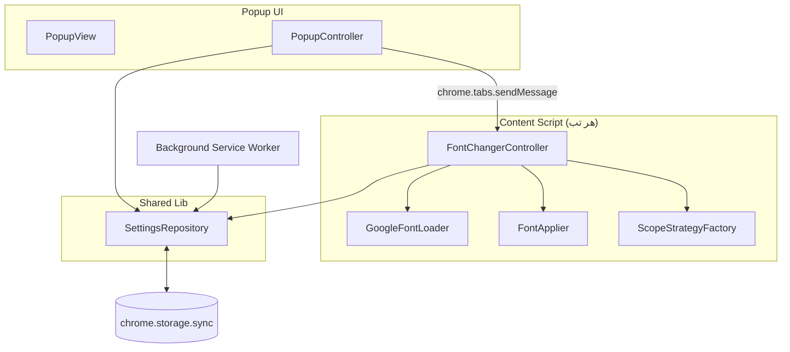

# Font Changer for Microsoft Edge (Google Fonts)

افزونه‌ای برای مرورگر Microsoft Edge (سازگار با Chrome/Chromium نیز هست، چون از
Manifest V3 استاندارد استفاده می‌کند) که به کاربر اجازه می‌دهد فونت هر وب‌سایتی را
با یکی از فونت‌های Google Fonts (مثل **Vazirmatn**) جایگزین کند.

## قابلیت‌ها

- انتخاب فونت از لیست فونت‌های محبوب گوگل (فارسی + لاتین) و تنظیم وزن فونت (300 تا 700)
- سه حالت اعمال فونت:
  - **همه سایت‌ها** (All Sites)
  - **فقط سایت‌های راست‌چین / RTL** (تشخیص خودکار با بررسی `dir` و `direction` صفحه)
  - **فقط سایت‌های سفارشی** (لیست دامنه‌های دلخواه کاربر)
- **فعال/غیرفعال کردن با یک کلیک روی هر سایت خاص**، مستقل از تنظیمات سراسری (Per-Site Override)
- صفحه **تنظیمات پیشرفته** برای مدیریت لیست سایت‌های سفارشی و بازنشانی تنظیمات
- صفحه **درباره ما** که سازنده و وب‌سایت شخصی (mhkarami97.ir) را معرفی می‌کند
- همگام‌سازی تنظیمات بین دستگاه‌ها با `chrome.storage.sync`

## معماری فنی (Architecture)

پروژه با رعایت اصول SOLID و چند Design Pattern پیاده‌سازی شده است:

| فایل / کلاس | الگو / اصل | توضیح |
|---|---|---|
| `lib/settings-repository.js` -> `SettingsRepository` | Repository Pattern | انتزاع کامل لایه ذخیره‌سازی از بقیه اپلیکیشن |
| `lib/scope-strategies.js` -> `ScopeStrategy*` | Strategy + Factory Pattern | تصمیم‌گیری در مورد اینکه آیا فونت روی یک سایت خاص اعمال شود یا نه (All / RTL / Custom / Off) |
| `content/content.js` -> `GoogleFontLoader`, `FontApplier` | Single Responsibility | جدا بودن مسئولیت «بارگذاری فونت» از «اعمال CSS» |
| `content/content.js` -> `FontChangerController` | Facade Pattern | نقطه هماهنگی بین Repository، Strategy و Applier |
| `popup/popup.js` -> `PopupView` / `PopupController` | MVC ساده | جدا بودن منطق از DOM برای تست‌پذیری بهتر |
| `options/options.js` -> `OptionsController` | MVC ساده | مشابه popup برای صفحه تنظیمات پیشرفته |

### چرا CSS Injection به‌جای دستکاری هر Node؟

به‌جای پیمایش تمام عناصر صفحه (`querySelectorAll('*')`) و ست کردن
`element.style.fontFamily` روی هر یک (که باعث Layout Thrashing و افت شدید
Performance در صفحات بزرگ می‌شود)، یک تگ `<style>` واحد با قانون
`* { font-family: ... !important }` تزریق می‌شود. این کار به مرورگر اجازه
می‌دهد بهینه‌سازی‌های داخلی CSSOM را انجام دهد و فقط یک Reflow رخ می‌دهد.

### Diagram معماری



## ساختار پوشه‌ها

```
font-changer-extension/
├── manifest.json
├── background/
│   └── background.js
├── content/
│   └── content.js
├── lib/
│   ├── settings-repository.js
│   └── scope-strategies.js
├── popup/
│   ├── popup.html
│   ├── popup.css
│   ├── popup.js
│   └── fonts-catalog.js
├── options/
│   ├── options.html
│   ├── options.css
│   └── options.js
├── about/
│   └── about.html
└── icons/
    ├── icon16.png
    ├── icon32.png
    ├── icon48.png
    └── icon128.png
```

## نصب برای تست (Load Unpacked)

1. آدرس `edge://extensions` را در Edge باز کنید.
2. گزینه **Developer mode** را در گوشه پایین-سمت-چپ فعال کنید.
3. روی **Load unpacked** کلیک کنید و پوشه `font-changer-extension` را انتخاب کنید.
4. آیکن افزونه در نوار ابزار ظاهر می‌شود؛ روی آن کلیک کنید تا Popup باز شود.

## روش انتشار در Microsoft Edge Add-ons Store

بر اساس مستندات رسمی مایکروسافت [1]:

1. یک حساب کاربری در [Partner Center](https://partner.microsoft.com/dashboard) بسازید
   (اگر قبلاً حساب توسعه‌دهنده Microsoft ندارید، هزینه‌ای ندارد، برخلاف Chrome Web Store).
2. پوشه پروژه را (همین فایل zip ضمیمه) فشرده کنید (فایل zip باید شامل `manifest.json` در ریشه باشد).
3. در Partner Center وارد بخش **Microsoft Edge > Extensions** شوید و **Create new extension** را بزنید.
4. فایل ZIP را آپلود کنید. Partner Center به‌طور خودکار `manifest.json` را اعتبارسنجی می‌کند.
5. اطلاعات فروشگاهی را تکمیل کنید: نام، توضیحات کوتاه/بلند، دسته‌بندی (Productivity)،
   حداقل ۱ تا ۵ اسکرین‌شات (1280x800 یا 640x400)، آیکون 300x300 برای صفحه Store.
6. سیاست حریم خصوصی (Privacy Policy URL) وارد کنید — چون افزونه `<all_urls>` می‌خواهد،
   Edge Store یک توضیح دقیق درباره دلیل استفاده از این permission می‌خواهد.
7. روی **Submit for review** کلیک کنید. زمان بررسی معمولاً چند روز کاری طول می‌کشد.
8. پس از تایید، افزونه در [Microsoft Edge Add-ons](https://microsoftedge.microsoft.com/addons) منتشر می‌شود.

### نکات مهم قبل از انتشار

- چون از `host_permissions: ["<all_urls>"]` استفاده شده، حتماً در توضیحات Store دلیل آن
  (اعمال فونت روی هر سایتی که کاربر انتخاب می‌کند) را ذکر کنید تا رد نشود.
- Manifest V3 اجباری است؛ Manifest V2 دیگر برای افزونه‌های جدید پذیرفته نمی‌شود.
- قبل از ارسال، افزونه را حداقل روی ۵ سایت مختلف (شامل یک سایت RTL فارسی) تست کنید.

## منابع (References)

1. Publish a Microsoft Edge extension — Microsoft Learn:
   https://learn.microsoft.com/en-us/microsoft-edge/extensions/publish/publish-extension
2. Content scripts — Chrome for Developers:
   https://developer.chrome.com/docs/extensions/develop/concepts/content-scripts
3. chrome.scripting API Reference:
   https://developer.chrome.com/docs/extensions/reference/scripting/
4. Google Fonts CSS2 API:
   https://developers.google.com/fonts/docs/css2

---
ساخته‌شده توسط محمد حسین کرمی — [mhkarami97.ir](https://mhkarami97.ir)


## به‌روزرسانی نسخه ۱.۱.۰

### ۱. حل مشکل ناپدید شدن آیکون‌ها (Font Awesome, Material Symbols/Google Symbols)

بسیاری از سایت‌ها (مثل گوگل با `font-family: Google Symbols` یا `Material Symbols`)
برای رندر آیکون‌ها از یک فونت اختصاصی استفاده می‌کنند. اعمال یک قانون سراسری
`font-family` باعث می‌شد این آیکون‌ها به‌جای شکل درست، به‌صورت حروف/مربع خالی
نمایش داده شوند.

**راه‌حل:** کلاس جدید `IconFontDetector` قبل از اعمال فونت، تمام درخت DOM را
پیمایش می‌کند و `font-family` محاسبه‌شده (Computed Style) هر المان را با یک
لیست کلیدواژه از فونت‌های آیکونی شناخته‌شده (`Material Icons`, `Material Symbols`,
`Google Symbols`, `Font Awesome`, `Glyphicons`, `Ionicons` و غیره) مقایسه می‌کند.
المان‌های تطبیق‌یافته با `data-fc-icon="true"` علامت‌گذاری می‌شوند و در قانون CSS
تزریقی با `:not([data-fc-icon="true"])` از تغییر فونت مستثنی می‌مانند. یک
`MutationObserver` هم اضافه شده تا آیکون‌هایی که بعداً (مثلاً در اپ‌های SPA) به
صفحه اضافه می‌شوند نیز پوشش داده شوند.

### ۲. قابلیت جدید و مستقل: اجبار جهت راست‌به‌چپ (RTL Forcer)

یک قابلیت کاملاً مستقل از تغییر فونت اضافه شده که جهت نمایش صفحه را به RTL
تغییر می‌دهد (برای سایت‌هایی که به اشتباه یا به‌صورت پیش‌فرض LTR هستند اما
محتوای فارسی/عربی دارند). این قابلیت دقیقاً مثل تنظیمات فونت، سه حالت
مستقل دارد:

- همه سایت‌ها
- فقط سایت‌های سفارشی (لیست دامنه مجزا از لیست فونت)
- غیرفعال

و به همان روش، امکان فعال/غیرفعال‌سازی با یک کلیک فقط برای سایت جاری،
مستقل از تنظیمات فونت، در Popup فراهم شده است.

معماری این قابلیت با کلاس‌های `DirectionApplier` (اعمال/بازگردانی `dir` و
CSS جهت) و `DirectionController` (Facade) پیاده‌سازی شده که هیچ وابستگی‌ای
به کلاس‌های مربوط به فونت (`FontApplier`, `FontChangerController`) ندارند؛
تنظیمات آن‌ها هم در کلیدهای جداگانه (`rtlScope`, `rtlCustomSites`,
`rtlPerSiteOverrides`) در `SettingsRepository` ذخیره می‌شود.

### فایل‌های تغییر یافته

| فایل | تغییر |
|---|---|
| `content/content.js` | افزودن `IconFontDetector`, `DirectionApplier`, `DirectionController` |
| `lib/settings-repository.js` | افزودن `rtlScope`, `rtlCustomSites`, `rtlPerSiteOverrides` + متد `setRtlPerSiteOverride` |
| `lib/scope-strategies.js` | `CustomSitesStrategy` عمومی‌سازی شد تا هم برای فونت و هم RTL بازاستفاده شود |
| `popup/popup.html`, `popup/popup.js`, `popup/popup.css` | افزودن بخش مستقل RTL با کلاس کمکی `SiteListEditor` |
| `options/options.html`, `options/options.js` | افزودن جدول مدیریت دامنه‌های سفارشی RTL |


## به‌روزرسانی نسخه ۱.۲.۰ - رفع مشکل آیکون‌ها در Google Maps

### چرا راه‌حل قبلی (`:not([data-fc-icon])`) روی Google Maps کار نکرد؟

Google Maps (و بسیاری از اپلیکیشن‌های مدرن گوگل) از **Web Components با
Shadow DOM** ساخته شده‌اند. طبق مشخصات استاندارد Shadow DOM:

- شیوه‌نامه (stylesheet) تزریق‌شده در سند اصلی (Light DOM) به داخل درخت
  Shadow نفوذ نمی‌کند، اما مرورگر همچنان به المان‌های داخل Shadow DOM
  دسترسی جاوااسکریپتی می‌دهد (اگر Shadow Root از نوع `open` باشد).
- `font-family` یک ویژگی ارثی (Inheritable Property) است و از طریق مرز
  Shadow به پایین به ارث می‌رسد؛ بنابراین حتی بدون نفوذ مستقیم CSS، تغییر
  فونت روی `<html>` می‌تواند آیکون‌های داخل Shadow DOM را هم تحت تاثیر
  قرار دهد.
- نسخه قبلی افزونه فقط Light DOM را با `document.body.querySelectorAll('*')`
  پیمایش می‌کرد و هرگز وارد `shadowRoot` عناصر نمی‌شد، پس آیکون‌های داخل
  کامپوننت‌های گوگل مپ اصلاً علامت‌گذاری نمی‌شدند.

### راه‌حل جدید

دو تغییر اصلی اعمال شد:

1. **`ShadowDomWalker`**: کلاس جدیدی که به‌صورت بازگشتی هم درخت اصلی سند و
   هم تمام `shadowRoot` های قابل‌دسترسی (`open`) داخل آن را پیمایش می‌کند.
   (توجه: Shadow Root های `closed` به دلایل امنیتی توسط خودِ پلتفرم مرورگر
   از دسترسی جاوااسکریپت مخفی می‌شوند؛ این یک محدودیت استاندارد وب است، نه
   محدودیت افزونه.)
2. **قفل inline به‌جای `:not()` در stylesheet**: به‌جای تکیه بر یک
   selector پیچیده در `<style>` که در Shadow DOM اثر ندارد، فونت اصلی هر
   المان آیکونی به‌صورت `element.style.setProperty("font-family", ..., "important")`
   مستقیماً روی خود المان قفل می‌شود. طبق قوانین Cascade در CSS، یک
   `inline style` با `!important` همیشه بر یک قانون `!important` در
   stylesheet خارجی اولویت دارد؛ این تضمین می‌کند فونت آیکون مستقل از
   Light/Shadow DOM بودن دست‌نخورده باقی بماند.

یک `MutationObserver` با debounce ۲۰۰ میلی‌ثانیه‌ای هم به تمام Shadow
Root های فعلی و آینده متصل می‌شود تا آیکون‌هایی که بعداً به‌صورت داینامیک
(هنگام Pan/Zoom نقشه) رندر می‌شوند نیز پوشش داده شوند.

### محدودیت شناخته‌شده

اگر یک سایت آیکون‌های خود را داخل یک `Shadow Root` از نوع `closed`
رندر کند (بسیار نادر است)، هیچ افزونه مرورگری - نه فقط این افزونه - امکان
دسترسی به آن المان‌ها را ندارد؛ این یک تصمیم امنیتی عمدی در پلتفرم وب است.
